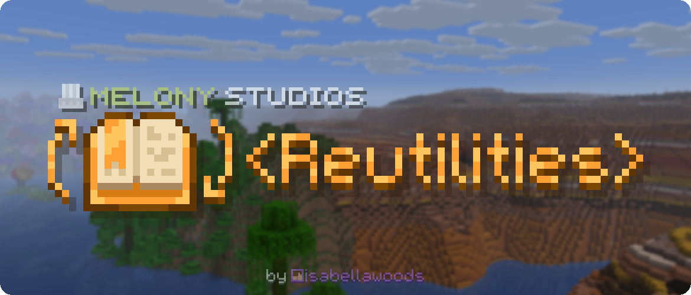

<div style="text-align: center;">
  
</div>

<sup>*For NeoForge 1.21.1*</sup>

***Reutilities*** is a library mod for all of Melony Studios' mods beginning in 1.21.1. It unifies most of the code that was used across my mods,
and ports various useful and extensible features, such as [**outfit definitions**](https://github.com/isabellawoods/Informational-Mod-Features/blob/main/Reutilities/Docs/Outfit%20Definition.md), from *Back Math*,
and **item behaviors**, from *Revaried*.

This mod also provides some functionality by itself, be it a small feature from another mod of mine, or something new altogether:
- **Component Display**: Displays the data components of an item stack in its tooltips. Works for every item (from *Revaried*);
- **Panoramic Screenshots**: Reimplemented from vanilla, this allows you to create new panoramas by pressing Ctrl + F2 (by default);
  - ***This does not work with Iris Shaders!***
- **Custom Boats and Signs**: New boats and signs can be created using a single method and a `BoatType` or `WoodType`, excluding the items/blocks, of course;
- **Emissive Lighting**: Items, armors, trims and outfits can define their luminosity via the `reutilities:light_emission` component, or any of the `#c:emissive_lighting` tags;
- **Glowing Light Sources**: Blocks that emit light will always have with at least that light level when rendered in the world.

*Reutilities* also provides compatibility between other mods. Currently, this only includes [*Female Gender Mod*](https://modrinth.com/mod/female-gender):
- Item emissiveness and outfits render properly on the wearer's breasts;
- Ability to change the voice pitch of the hurt sound, backported from the newer versions (not sure if this is working);
- Increases the maximum breast size to **150%**, from the original **80%** of this 1.21 version.

## Block/Recipe Family Providers
<sup>*Ported from Back Math*</sup>

**Block** and **recipe family providers** are a simple way to make multiple block models or recipes without needing to while multiple lines of code.

Below is an example implementation of both family providers using the avondale wood set from *Numinosity*:
```java
// Recipes
RecipeFamilyProvider.builder(output, NumiItems.AVONDALE_PLANKS).woodenStairs(NumiItems.AVONDALE_STAIRS).build();

// Block models (assuming the class extends ReBlockStateProvider)
this.blockFamily(this.modLoc("block/avondale_planks"), "avondale").stairs(NumiBlocks.AVONDALE_STAIRS.get()).build();
```

## The API
*Reutilities*' API, known as **ReAPI**, allows you to easily register new boats, signs, colors, breast armor definitions and more, as well as give items their properties and create armor material layers.

The `api` package also includes `ReCodecs`, which provides codec utilities, and `ReTiers`, to create new tiers for tools.

## Development
To add *Reutilities* to the development environment, you'll need to add the following line to the `dependencies` block in your `build.gradle` file:
```groovy
/// [...other dependencies]

// External libraries
// Reutilities
implementation files("build/libs/reutilities-neoforge-${reutilities_version}+${minecraft_version}.jar")
```

This will add the *Reutilities* jar file located inside `build/libs/`, where `reutilities_version` is the version of the mod you want to use. 
This property should be added to your `gradle.properties` file, but can inline it if you want to.

On the [GitHub Releases](https://github.com/isabellawoods/Reutilities/releases) page, a **sources** jar is provided for the versions released to keep the JavaDocs.

It is also recommended to add a hard dependency on this mod through the **neoforge.mods.toml** file.
The dependency should always target the version being used, as I tend to make many breaking changes between versions:
```toml
# Dependency for Reutilities
[[dependencies.examplemod]]
    modId = "reutilities"
    type = "required"
    versionRange = "[1.5.0,)" # Latest version of the mod as of writing this
    ordering = "NONE"
    side = "BOTH"
```

### Data Generation
By default, if you extend a *Reutilities* data generation class, the generator will be unable to find the `reutilities` resource pack.

To fix this, you can create a copy of the "Data" run configuration, and change the name of `dataRunProgramArgs.txt` to something else (like `dataRunProgramArgsCopy.txt`),
and name the configuration something other than "Data" (like "Data 2"), as reloading Gradle will override any changes made to the configuration.

Inside the `dataRunProgramArgsCopy.txt` file, you'll need to add the line below. That line tells the data generator that the `reutilities` resource pack exists, so generated resources can target it.
```text
[...other fields used for data generation and launching the game]
--existing-mod
reutilities
```