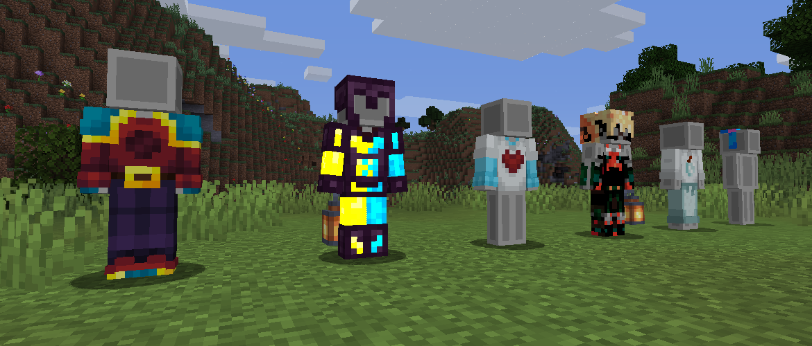

***Reutilities*** is a library mod for all of Melony Studios' mods beginning in 1.21.1.

## Features
### Outfit Definitions


<sup>*Ported from [Back Math](https://github.com/isabellawoods/Back-Math)*</sup>

**Outfit definitions** are a set of textures to use for an outfit item or `outfit` tag. These can be used to make items render as a clothing piece on top of the player's skin.

### Block Family Providers
<sup>*Ported from [Back Math](https://github.com/isabellawoods/Back-Math)*</sup>

**Block** and **recipe family providers** are a simple way to make multiple block models or recipes without needing to while multiple lines of code.
```java
// Recipes
FamilyRecipeProvider.builder(output, ExampleItems.EXAMPLE_PLANKS).woodenStairs(ExampleItems.EXAMPLE_STAIRS).build();

// Block models (assuming the class extends ReBlockStateProvider)
this.blockFamily(this.modLoc("block/example_planks"), "example").stairs(ExampleBlocks.EXAMPLE_STAIRS.get()).build();
```

### The API
New boats and signs can easily be added by using ***Reutilities*'s API**, as well as many other features like item properties and armor material layers.